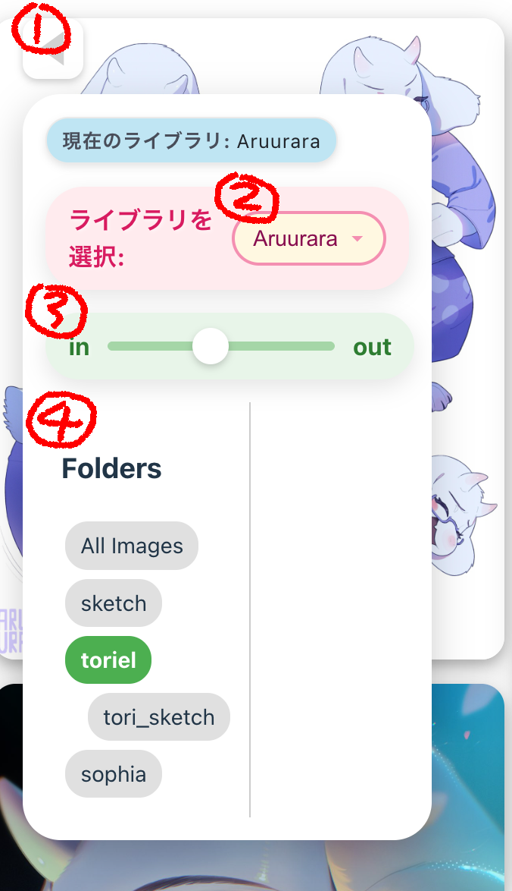

#  Eagle_Library_For_Web

このプロジェクトは、[Eagle](https://eagle.cool/) で管理されているライブラリをWebブラウザから見られるようにします。現状対応しているのはpngやjpgなどの画像ファイルのみですが、将来的にはいろんな形式に対応できたらと思います。

## 目次
- [機能](#機能)
- [セットアップ](#セットアップ)
- [設定](#設定)
- [アプリケーションの実行](#アプリケーションの実行)
- [ビルドとプレビュー](#ビルドとプレビュー)

## 機能

### 無限スクロール


画像リストは無限スクロールに対応しています。
ページを下にスクロールすると、新しい画像が自動的に読み込まれ、表示されます。
これにより、大量の画像を効率的に閲覧することができます。

### オプションパネル


アプリケーションの左側には、以下の機能を提供するオプションパネルがあります。
<table>
  <tr>
    <td>
      
    </td>
    <td>
      <ul>
        <li><strong>①パネルの表示/非表示:</strong> 左上のボタン（▶ または ◀）をクリックすることで、オプションパネルの表示/非表示を切り替えできます。パネルを隠すことで、画像表示領域を広げられます。</li>
        <li><strong>②ライブラリ選択:</strong> ドロップダウンメニューから、Eagleのライブラリを切り替えができます。ライブラリを切り替えると、ページがリロードされ、新しいライブラリのコンテンツが表示されます。</li>
        <li><strong>③列数調整スライダー:</b> 画像の表示列数を調整できます。スライダーを動かすことで、画像の表示サイズとレイアウトを動的に変更できます。</li>
        <li><strong>④フォルダツリー:</strong> Eagleライブラリ内のフォルダ構造をツリー形式で表示します。特定のフォルダをクリックすると、そのフォルダ内の画像のみが表示されます。</li>
      </ul>
    </td>
  </tr>
</table>

### 画像の拡大表示

画像をクリックやタップすると、その画像がモーダルウィンドウで拡大表示されます。スワイプで次の画像に移動することも可能です。モーダルウィンドウでは、画像の詳細（Eagleでの登録情報など）を表示することもできます。

モーダルウィンドウでは、画像の詳細（Eagleでの登録情報など）を表示することもできます。

---

## セットアップ

### 前提条件

*   Python 3.8以上
*   Node.js (LTS推奨)
*   npm または Yarn

### 1. リポジリのクローン

```bash
git clone https://github.com/your-username/eagle_web.git
cd eagle_web
```

### 2. バックエンドのセットアップ

Pythonの依存関係をインストールします。

```bash
pip install -r requirements.txt
```

### 3. フロントエンドのセットアップ

Node.jsの依存関係をインストールします。

```bash
npm install
# または yarn install
```

---

## 設定

### バックエンドの設定

バックエンドの設定は `backend/settings.json` ファイルで行います。このファイルはGit管理から除外されているため、`backend/settings.json.example` をコピーして作成してください。

```bash
cp backend/settings.json.example backend/settings.json
```

`backend/settings.json` をテキストエディタで開き、以下の項目を設定します。

*   `EAGLE_LIBRARY_SEARCH_PATH`: Eagleライブラリ（`.library` フォルダ）を検索するルートパスを指定します。例: `"set/your/path/to/library"`
*   `ALLOW_ORIGINS`: CORS (Cross-Origin Resource Sharing) の許可オリジンを指定します。開発中は `["*"]` で全てを許可できますが、本番環境では具体的なオリジンを指定することを推奨します。例: `["http://localhost:3000", "https://your-domain.com"]`

```json
{
  "EAGLE_LIBRARY_SEARCH_PATH": "set/your/path/to/library",
  "ALLOW_ORIGINS": ["*"]
}
```

### フロントエンドのAPI接続設定

フロントエンドのAPI接続先は、`setting/` ディレクトリ内の `.env` ファイルで管理されます。これらのファイルには、バックエンドAPIの完全なURL（プロトコル、IPアドレス、ポートを含む）を `VITE_API_BASE_URL` という変数で定義します。

*   **`setting/.env.development`**: `npm run dev` で開発サーバーを起動する際に読み込まれます。通常は `http://localhost:8000` を指定しますが、同じローカルネットワーク内の他のデバイス（スマートフォンなど）からアクセスしたい場合は、バックエンドが動作しているPCの固定IPアドレス（例: `http://192.168.50.17:8000`）を指定すると便利です。
*   **`setting/.env.production`**: `npm run build` で本番ビルドを行う際に読み込まれます。本番環境のAPIの公開URLを指定してください。

例:
```env
VITE_API_BASE_URL="http://localhost:8000"
```

---

## アプリケーションの実行

プロジェクトのルートディレクトリから以下のコマンドを実行します。
このコマンドは、フロントエンドとバックエンドの両方を同時に起動します。

```bash
npm run dev
```

通常、ブラウザで `http://localhost:5173` (Viteのデフォルトポート) が開かれ、アプリケーションにアクセスできます。

---

## ビルドとプレビュー

アプリケーションをビルドし、その結果をローカルでプレビューする方法です。

### アプリケーションのビルド

以下のコマンドを実行すると、Viteはアプリケーションを最適化し、静的ファイルを `dist/` ディレクトリに生成します。

```bash
npm run build
```

### ビルドされたアプリケーションのプレビュー

ビルドされたアプリケーションが正しく動作するかを確認するために、簡易的な静的ファイルサーバーを起動できます。

```bash
npm run preview
```

このコマンドは `dist/` ディレクトリの内容を配信し、ブラウザでアクセス可能なURLを提供します。

---

## ライセンス

このプロジェクトはMITライセンスで提供されています。詳細については、[LICENSE](LICENSE) ファイルを参照してください。

## 免責事項

本プロジェクトは個人利用を想定しており、セキュリティに関する十分な考慮はされていません。本プロジェクトをインターネット上に公開するサーバーとして利用し、何らかのトラブル（データ漏洩、不正アクセス、サービス停止など）が発生した場合でも、作者は一切の責任を負いません。自己責任においてご利用ください。